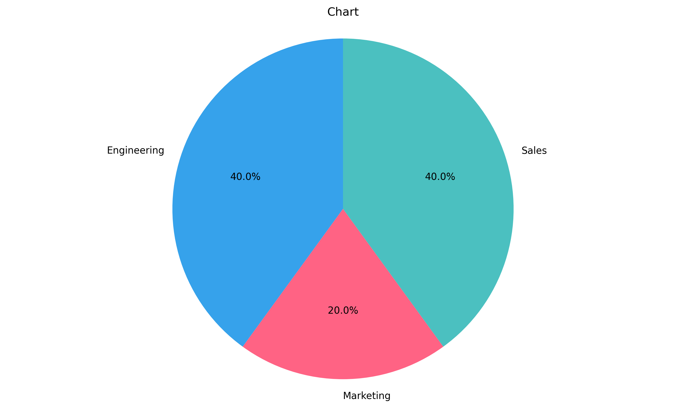
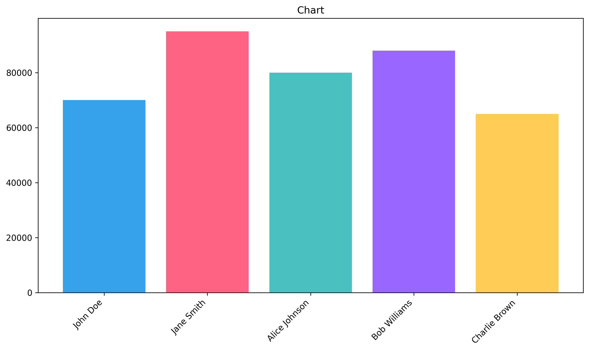

# LangGraph SQL Visualizer

This project demonstrates the power of LangGraph and LangChain for building an intelligent SQL agent with visualization capabilities. The agent can interact with SQL databases using natural language queries, provide answers based on database content, and generate visual representations of the data.

## Features
- **LLM Support**: Works with GPT-4o (OpenAI) and Gemini-2.0-flash (Google) models
- **LangGraph Architecture**: Utilizes LangGraph for building a modular, extensible agent workflow
- **Conversation Memory**: Maintains context across interactions using LangChain's ConversationBufferMemory
- **Data Visualization**: Generates interactive charts and graphs from SQL query results
  - Supports multiple chart types (bar, pie, line)
  - Automatically detects visualization requests in natural language
  - Renders and displays chart images in the default system viewer

## Setup
1. Clone the repository:
   ```bash
   git clone https://github.com/yourusername/langgraph-sql-visualizer.git
   ```
2. Navigate to the project directory:
   ```bash
   cd langgraph-sql-visualizer
   ```
3. Create a virtual environment and activate it:
   ```bash
   python -m venv .venv
   source .venv/bin/activate  # On Windows: .venv\Scripts\activate
   ```
4. Install the required packages:
   ```bash
   pip install -r requirements.txt
   ```
5. Set up environment variables:
   ```bash
   export OPENAI_API_KEY=<your_openai_api_key>
   export GOOGLE_API_KEY=<your_google_api_key>
   ```

## Usage
Run the application using:
```bash
python main.py
```

You will be prompted to select an LLM model (GPT-4o or Gemini-2.0-flash) and then you can start asking questions about the employee database.

### Example Queries
- Basic SQL queries:
  - "What are the salaries of my employees?"
  - "How many employees work in the Engineering department?"
  - "What is the average salary by department?"

- Visualization queries:
  - "Show me a bar chart of employee salaries"
  - "Create a pie chart of employees by department"
  - "Visualize the top 5 highest paid employees"
  - "Plot the results" (after a previous query)

## Sample Visualizations

Here are some examples of the visualizations generated by the application:

### Employee Salaries Bar Chart


### Department Distribution Pie Chart


The visualization agent automatically generates appropriate chart specifications based on the query and data, which are then rendered into images using Matplotlib.

## Architecture
The application uses a LangGraph-based architecture with the following components:

1. **SQL Agent**: Generates SQL queries based on natural language questions
2. **SQL Executor**: Executes the generated SQL queries against the database
3. **Answer Generator**: Creates natural language answers from SQL results
4. **Visualization Agent**: Generates chart specifications when visualization is requested
5. **Chart Renderer**: Renders chart images from the specifications

## Project Structure
- `agents/`: Contains the SQL and visualization agents
- `cli/`: Command-line interface for the application
- `db/`: Database setup and sample data
- `llm/`: LLM model loading and configuration
- `prompts/`: Prompt templates for the agents
- `visualization/`: Chart rendering and image generation
- `visualizations/`: Generated chart images (not tracked in git)

## Contributing
Contributions are welcome! Please feel free to submit a Pull Request.

## License
This project is licensed under the MIT License - see the LICENSE file for details.
